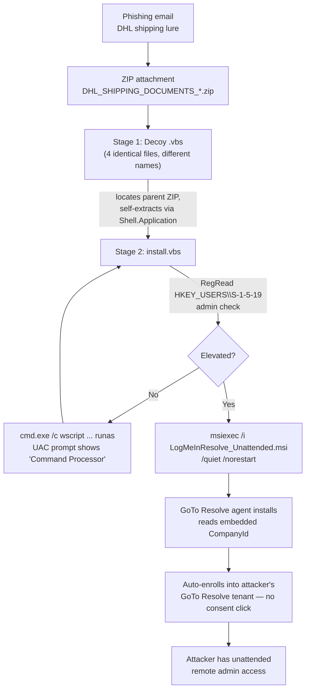

# DHL-Themed Phishing → Silent LogMeIn Resolve (GoTo Resolve) RMM Deployment

**Static & behavioral analysis of a phishing attachment that abuses a legitimate, signed RMM tool to gain unattended remote access — no custom malware involved.**

> ⚠️ **Safety notice:** This repository documents a real-world attack chain for defensive/educational purposes. If sample files are included, they are for **static analysis only**. Never execute them outside an isolated, network-controlled sandbox VM. See [Dynamic Analysis](#dynamic-analysis) below for a safe methodology.

---

## TL;DR

- Delivery: a ZIP attachment (`DHL_SHIPPING_DOCUMENTS_*.zip`) disguised as DHL shipping paperwork.
- Payload: **not malware** — a legitimate, DigiCert-signed **LogMeIn Resolve / GoTo Resolve** RMM installer.
- The MSI ships with an attacker-owned enrollment token (`CompanyId`) baked in, so on silent install the endpoint **auto-joins the attacker's RMM console with zero user consent**.
- Two VBScript stages handle privilege escalation (disguised UAC prompt) and the silent `msiexec /quiet` install.
- Detection is hard because the final payload is trusted, signed software — this is a **Living-off-Trusted-Software** technique, not a signature-detectable dropper.

---

## Attack Chain



---

## File Roles & Hashes

| File | Role | SHA-256 |
|---|---|---|
| `DHL_SHIPPING_DOCUMENTS_*.zip` | Delivery container | `fc9fe6ffbbfc76a6027a62a7997e01cf38c1cdf784b8b1797c61504fe75263d8` |
| `AIR_WAY_BILL...vbs` / `PACKING_LIST...vbs` / `COMMERCIAL_INVOICE...vbs` / `CUSTOM_REFERENCE_CERTIFICATES...vbs` | Stage 1 — identical decoy loader (4 filenames, 1 payload) | `083576745263071bd089d609b8eab2d2919b3014885741edf81e12de27c43740` |
| `<random>\install.vbs` | Stage 2 — UAC-disguised elevation + silent MSI install | `7944ed8753971f952130ea0c52a0ee9d7cef42f33b176234b08ab7f97a2cd262` |
| `<random>\LogMeInResolve_Unattended.msi` | Stage 3 — legitimate GoTo Resolve installer w/ attacker enrollment token | `29906168eba271442305389aebe91a5091ae933d551101ad60087f699ca2630f` |

Full write-up (timeline, per-stage code walkthrough, MITRE mapping, hunting queries, remediation) is in [`Incident_Analysis_Report_DHL_LogMeInResolve.docx`](./Incident_Analysis_Report_DHL_LogMeInResolve.docx).

---

## Key Finding: Embedded Enrollment Token

The MSI is genuine, signed GoTo, Inc. software — but this build carries a hardcoded JSON config that silently enrolls the endpoint into the attacker's own RMM tenant on install, with no pairing code required:

```json
{
  "CompanyId": "3719837408790104989",
  "BaseUrl": "https://devices-iot.console.gotoresolve.com/",
  "FleetTemplateName": "syn-prd-ava-unattended",
  "SessionBackendUrl": "https://sessions.console.gotoresolve.com"
}
```

---

## MITRE ATT&CK Mapping

| Tactic | Technique | ID |
|---|---|---|
| Initial Access | Phishing: Spearphishing Attachment | T1566.001 |
| Execution | User Execution: Malicious File | T1204.002 |
| Execution | Command & Scripting Interpreter: VBScript | T1059.005 |
| Defense Evasion | Masquerading | T1036 |
| Privilege Escalation | Abuse Elevation Control Mechanism: Bypass UAC | T1548.002 |
| Defense Evasion | System Binary Proxy Execution: Msiexec | T1218.007 |
| C2 / Persistence | Remote Access Software | T1219 |
| Defense Evasion | Indicator Removal: File Deletion | T1070.004 |

---

## Indicators of Compromise

**Filenames/paths**
```
DHL_SHIPPING_DOCUMENTS*.zip
AIR_WAY_BILL*.vbs | PACKING_LIST*.vbs | COMMERCIAL_INVOICE*.vbs | CUSTOM_REFERENCE_CERTIFICATES*.vbs
install.vbs (inside a short random subfolder, e.g. ttUh6Q, VwYddo)
LogMeInResolve_Unattended.msi
%TEMP%\Install_<numeric>\
%ProgramFiles%\GoTo Resolve Unattended\
```

**Network**
```
devices-iot.console.gotoresolve.com
sessions.console.gotoresolve.com
applet.console.gotoresolve.com
health.console.gotoresolve.com
secure.logmein.com
```

**Attacker enrollment ID:** `CompanyId 3719837408790104989`

---

## Detection (Elastic / ECS)

```
// Stage 1 → Stage 2 chain
process.name : "wscript.exe" and process.parent.name : "explorer.exe"
  and process.command_line : "*.vbs*"

// Disguised UAC elevation
process.name : "cmd.exe" and process.parent.name : "wscript.exe"
  and process.command_line : "*runas*" and process.command_line : "*wscript*"

// Silent RMM install
process.name : "msiexec.exe"
  and process.command_line : ("*quiet*" and "*norestart*")
  and (process.command_line : "*Resolve*" or process.command_line : "*LogMeIn*")

// Enrollment traffic
destination.domain : ("*.gotoresolve.com" or "*.logmein.com")
```

---

## Dynamic Analysis

If you want to reproduce the behavioral findings yourself:

1. **Quick pass:** submit the ZIP to a cloud sandbox (ANY.RUN, Joe Sandbox, Hybrid Analysis).
2. **Controlled pass:** isolated VM (host-only network, no internet), Procmon + Sysmon + Wireshark, optionally `FakeNet-NG`/`INetSim` to fake DNS/HTTP so the enrollment attempt is observable without ever reaching the real attacker tenant. Snapshot before, revert after.

Do not detonate with real internet access unless deliberately choosing to, and never from infrastructure traceable to the affected organization — a live run would register a real device against the attacker's console.

---

## Remediation Summary

- Isolate the host before any cleanup.
- Preserve evidence (memory/disk image, event logs) if treating as an active incident.
- Uninstall via `GoToResolveUnattendedRemover.exe -msiuninstall` or `msiexec /x {1A79EF7B-92DC-4473-9510-E71BBA20B2FC} /quiet /norestart`.
- Hunt for additional persistence added during any attacker dwell time.
- Rotate credentials used on the affected machine.
- Prefer a full reimage over manual cleanup once unattended admin RMM access is confirmed.
- Report the `CompanyId` to GoTo/LogMeIn abuse to request tenant suspension.

---

## Disclaimer

This analysis is published for defensive security research, SOC training, and detection-engineering purposes only. No malicious code is provided in executable form. Reproduce findings only in isolated, non-production environments you control.

---

## Author

Analysis by **Nimesh** — Cybersecurity Intern (SOC / Threat Research).
